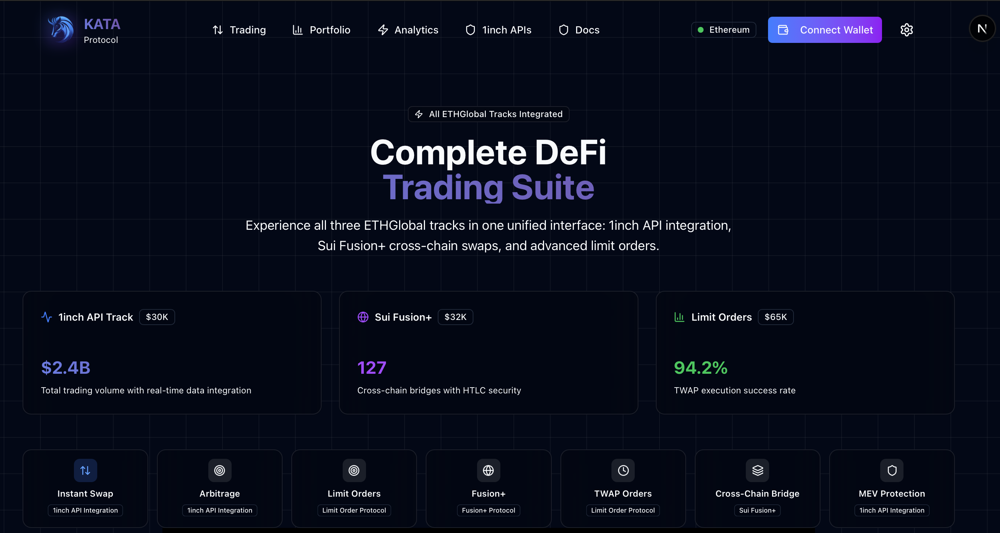
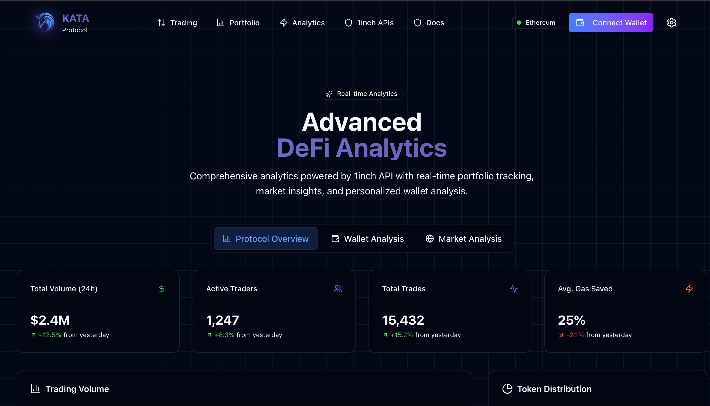
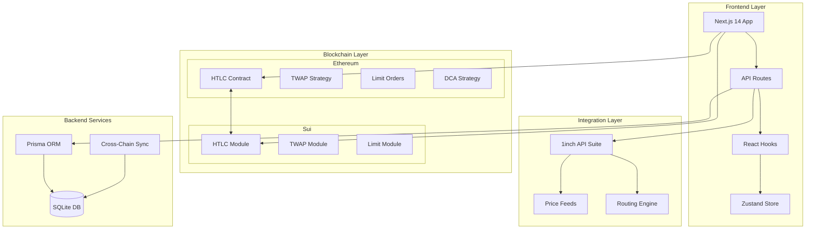
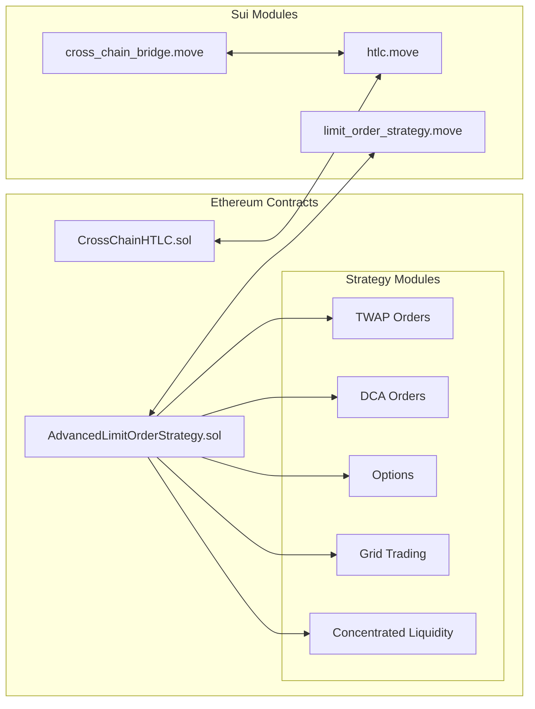
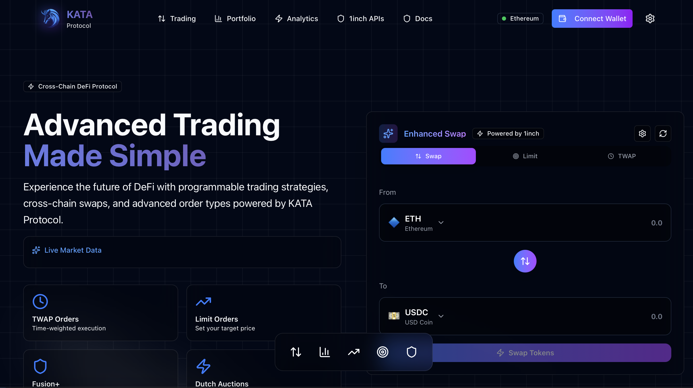

# KATA Protocol

<div align="center">
  
  
  **🥋 Advanced Cross-Chain DeFi Trading Suite**
  
  *Programmable trading strategies meet cross-chain atomic swaps*
  
  [](https://ethereum.org/)
  [](https://sui.io/)
  [](https://1inch.io/)
  [](https://www.typescriptlang.org/)
</div>

---

## 🌟 Overview

**KATA Protocol** is a next-generation cross-chain DeFi platform that combines **Ethereum ↔ Sui atomic swaps** with **advanced limit order strategies** powered by the 1inch API ecosystem. 

> **💡 About the Name:**  
> "Kata" (型) in Japanese martial arts refers to precise, pre-defined sequences of efficient movements. This reflects our protocol's focus on **automated, programmable, and efficient trading strategies** - a clever nod to the martial arts inspiration behind 1inch.

### 🎯 What Makes KATA Special

- **🔄 Cross-Chain Native**: Seamless Ethereum ↔ Sui swaps using Hash Time Lock Contracts (HTLC)
- **🎯 Advanced Strategies**: TWAP, DCA, Options, Grid Trading, and Concentrated Liquidity
- **🛡️ MEV Protection**: Built-in safeguards against front-running and sandwich attacks
- **📊 Real-Time Analytics**: Comprehensive portfolio tracking and market insights
- **⚡ 1inch Integration**: Full API suite integration for optimal routing and pricing

---

## 🚀 Features

### 🔥 Core Trading Features

| Feature | Description | Status |
|---------|-------------|--------|
| **Enhanced Swap** | 1inch-powered token swaps with advanced routing | ✅ Live |
| **TWAP Orders** | Time-weighted average price execution | ✅ Live |
| **Limit Orders** | Advanced limit orders with custom conditions | ✅ Live |
| **Cross-Chain Bridge** | Ethereum ↔ Sui atomic swaps | ✅ Live |
| **Grid Trading** | Automated buy/sell grid strategies | ✅ Live |
| **DCA Orders** | Dollar cost averaging automation | ✅ Live |
| **Options Trading** | Synthetic options with collateral management | ✅ Live |

<div align="center">
  
  <p><em>Advanced Trading Interface with Multiple Strategy Types</em></p>
</div>

### 📊 Analytics & Portfolio

| Feature | Description | Status |
|---------|-------------|--------|
| **Portfolio Tracking** | Multi-chain asset tracking and P&L | ✅ Live |
| **Market Analytics** | Real-time market data and insights | ✅ Live |
| **Transaction History** | Complete trading history across chains | ✅ Live |
| **Performance Metrics** | Strategy performance and optimization | ✅ Live |

<div align="center">
  
  <p><em>Comprehensive Analytics Dashboard with Real-Time Data</em></p>
</div>

### 🛡️ Security & Protection

- **Hash Time Lock Contracts (HTLC)**: Atomic swap security
- **Slippage Protection**: Configurable slippage limits
- **Collateral Management**: Automated option collateral handling
- **Access Controls**: Role-based contract permissions
- **Emergency Pause**: Circuit breaker mechanisms

---

## 🏗️ Architecture

### 📋 System Overview



### 🔧 Smart Contract Architecture



### 📁 Project Structure

```
kata-protocol/
├── 📁 contracts/                 # Smart Contracts
│   ├── 📁 ethereum/              # Solidity contracts
│   │   ├── 📄 AdvancedLimitOrderStrategy.sol
│   │   ├── 📄 CrossChainHTLC.sol
│   │   └── 📁 test/              # Contract tests
│   └── 📁 sui/                   # Move contracts
│       ├── 📄 htlc.move
│       ├── 📄 limit_order_strategy.move
│       └── 📄 cross_chain_bridge.move
├── 📁 frontend/                  # Next.js Application
│   ├── 📁 src/
│   │   ├── 📁 app/               # App Router
│   │   ├── 📁 components/        # React Components
│   │   ├── 📁 hooks/             # Custom Hooks
│   │   ├── 📁 services/          # API Services
│   │   ├── 📁 store/             # Zustand Store
│   │   ├── 📁 types/             # TypeScript Types
│   │   └── 📁 utils/             # Utility Functions
│   └── 📁 assets/                # Static Assets
├── 📁 backend/                   # Node.js Backend
│   ├── 📄 server.js              # Express Server
│   ├── 📁 services/              # Business Logic
│   ├── 📁 prisma/                # Database Schema
│   └── 📁 utils/                 # Backend Utilities
└── 📁 docs/                      # Documentation
```

---

## 🛠️ Technology Stack

### 🖥️ Frontend Stack

| Technology | Version | Purpose |
|------------|---------|---------|
| **Next.js** | 14.0+ | React framework with App Router |
| **React** | 18.0+ | UI library with modern hooks |
| **TypeScript** | 5.0+ | Type-safe development |
| **Tailwind CSS** | 3.0+ | Utility-first styling |
| **Framer Motion** | 10.0+ | Animation library |
| **Zustand** | 4.0+ | Lightweight state management |

### ⛓️ Blockchain Stack

| Technology | Purpose |
|------------|---------|
| **Solidity** | Ethereum smart contracts |
| **Move** | Sui blockchain programming |
| **Ethers.js** | Ethereum interaction library |
| **@mysten/sui.js** | Sui SDK for TypeScript |
| **Hardhat** | Ethereum development environment |

### 🔌 Integration Stack

| Technology | Purpose |
|------------|---------|
| **1inch API** | DEX aggregation and routing |
| **Prisma** | Database ORM |
| **SQLite** | Development database |
| **Express.js** | Backend API server |

---

## 📦 Installation & Setup

### ✅ Prerequisites

- **Node.js** 18+ 
- **npm** or **yarn**
- **Git**
- **MetaMask** or compatible wallet
- **Sui Wallet** browser extension

### 🚀 Quick Start

```bash
# 1. Clone the repository
git clone https://github.com/Zireaelst/kata-protocol.git
cd kata-protocol

# 2. Install dependencies
npm install

# 3. Install frontend dependencies
cd frontend && npm install && cd ..

# 4. Install backend dependencies  
cd backend && npm install && cd ..

# 5. Install contract dependencies
cd contracts/ethereum && npm install && cd ../..

# 6. Setup environment variables
cp .env.example .env.local
# Edit .env.local with your API keys

# 7. Setup database
cd backend && npx prisma db push && cd ..

# 8. Start development servers
npm run dev
```

### 🔑 Environment Configuration

Create `.env.local` in the project root:

```bash
# 1inch API Configuration
NEXT_PUBLIC_ONEINCH_API_KEY=your_1inch_api_key_here

# RPC URLs
NEXT_PUBLIC_ETHEREUM_RPC_URL=https://eth-mainnet.alchemyapi.io/v2/your-key
NEXT_PUBLIC_SUI_RPC_URL=https://fullnode.mainnet.sui.io

# Database
DATABASE_URL="file:./dev.db"

# Contract Addresses (deployed)
NEXT_PUBLIC_ETHEREUM_HTLC_ADDRESS=0x...
NEXT_PUBLIC_SUI_HTLC_ADDRESS=0x...
```

---

## 🎯 Core Components

### 🔄 Cross-Chain Atomic Swaps

The heart of KATA Protocol is secure, trustless atomic swaps between Ethereum and Sui:

```solidity
// Ethereum HTLC Contract
contract CrossChainHTLC {
    function createSwap(
        address recipient,
        bytes32 hashlock,
        uint256 timelock,
        bytes32 suiOrderHash
    ) external payable returns (bytes32 swapId);
    
    function claimSwap(
        bytes32 swapId,
        bytes32 preimage
    ) external;
}
```

```move
// Sui HTLC Module
module htlc::cross_chain {
    public fun create_swap(
        recipient: address,
        hashlock: vector<u8>,
        timelock: u64,
        amount: u64,
        ctx: &mut TxContext
    ): SwapId;
}
```

### 📊 Advanced Trading Strategies

#### 🎯 TWAP (Time-Weighted Average Price)

Split large orders across time to reduce market impact:

```typescript
const twapOrder = await createTWAPOrder({
  tokenIn: "0xA0b86a33E6411a3bb4c6212b8e9c1a0e5D4c6b3c",
  tokenOut: "0xdAC17F958D2ee523a2206206994597C13D831ec7",
  totalAmount: "10000", // 10,000 tokens
  intervals: 10,        // Execute 10 times
  intervalDuration: 3600, // Every hour
  minPricePerToken: "0.95",
  maxPricePerToken: "1.05"
});
```

#### 💰 DCA (Dollar Cost Averaging)

Automate regular purchases to reduce volatility impact:

```typescript
const dcaOrder = await createDCAOrder({
  tokenIn: "0xUSDC",
  tokenOut: "0xWETH",
  totalAmount: "5000",     // $5000 total
  frequency: 86400,        // Daily (24h)
  amountPerExecution: "100", // $100 per day
  maxSlippage: 100         // 1% max slippage
});
```

### 🔌 1inch API Integration

Complete integration with 1inch's API suite:

```typescript
// Price API - Get token prices
const prices = await getTokenPrices(['ETH', 'USDC', 'WBTC']);

// Swap API - Get best route
const quote = await getSwapQuote({
  fromTokenAddress: '0xA0b86a33...',
  toTokenAddress: '0xdAC17F958D...',
  amount: '1000000000000000000' // 1 ETH
});

// Portfolio API - Track performance
const portfolio = await getPortfolioData(walletAddress);
```

---

## 📸 Interface Screenshots

<div align="center">
  
  <p><em>🏠 Modern Landing Page with Feature Overview</em></p>
</div>

### Key Interface Features:

- **🎨 Modern UI/UX**: Glassmorphism design with smooth animations
- **📱 Responsive Design**: Mobile-first approach with adaptive layouts
- **⚡ Real-Time Updates**: Live price feeds and transaction status
- **🌙 Dark Mode**: Optimized for extended trading sessions
- **🔄 Multi-Chain**: Seamless switching between Ethereum and Sui

---

## 🧪 Testing & Development

### 🔧 Running Tests

```bash
# Smart Contract Tests
cd contracts/ethereum
npm test

# Frontend Tests
cd frontend
npm test

# Backend Tests
cd backend
npm test

# Integration Tests
npm run test:integration
```

### 🛠️ Development Scripts

```bash
# Start all services
npm run dev

# Frontend only
npm run dev:frontend

# Backend only
npm run dev:backend

# Deploy contracts (testnet)
npm run deploy:testnet

# Build for production
npm run build
```

---

## 🚀 Deployment

### 🌐 Frontend Deployment (Vercel)

```bash
# Build optimized frontend
cd frontend && npm run build

# Deploy to Vercel
vercel --prod
```

### ⛓️ Smart Contract Deployment

```bash
# Ethereum contracts
cd contracts/ethereum
npx hardhat deploy --network mainnet

# Sui contracts
cd contracts/sui
sui move publish
```

---

## 🤝 Contributing

We welcome contributions! Please see our [Contributing Guidelines](CONTRIBUTING.md).

### 🔄 Development Workflow

1. **Fork** the repository
2. **Create** a feature branch (`git checkout -b feature/amazing-feature`)
3. **Commit** your changes (`git commit -m 'Add amazing feature'`)
4. **Push** to the branch (`git push origin feature/amazing-feature`)
5. **Open** a Pull Request

### 📋 Code Standards

- **TypeScript**: Strict mode enabled
- **ESLint**: Airbnb configuration
- **Prettier**: Consistent formatting
- **Testing**: >80% test coverage required

---

## 📚 Documentation

- **📖 [Smart Contract Docs](docs/contracts.md)** - Contract architecture and functions
- **🔌 [API Reference](docs/api.md)** - Complete API documentation
- **🎯 [Strategy Guide](docs/strategies.md)** - Trading strategy implementation
- **🔒 [Security Guide](docs/security.md)** - Security best practices
- **🚀 [Deployment Guide](docs/deployment.md)** - Production deployment

---

## 🔒 Security

### 🛡️ Security Measures

- **Audited Contracts**: Professional security audits
- **Formal Verification**: Mathematical proof of correctness
- **Bug Bounty**: Ongoing security research program
- **Multi-Sig**: Governance with multi-signature wallets

### 🚨 Reporting Security Issues

Please email security issues to: **security@kata-protocol.com**

---

## 📄 License

This project is licensed under the **MIT License** - see the [LICENSE](LICENSE) file for details.

---

## 🌐 Links & Community

- **🌍 Website**: [kata-protocol.com](https://kata-protocol.com)
- **🐦 Twitter**: [@kata_protocol](https://twitter.com/kata_protocol)
- **💬 Discord**: [Join our community](https://discord.gg/kata-protocol)
- **📱 Telegram**: [@kata_protocol](https://t.me/kata_protocol)
- **📺 YouTube**: [KATA Protocol](https://youtube.com/@kata-protocol)

---

## ⚡ Quick Links

| Resource | Link |
|----------|------|
| 🏗️ **Live Demo** | [demo.kata-protocol.com](https://demo.kata-protocol.com) |
| 📊 **Analytics** | [analytics.kata-protocol.com](https://analytics.kata-protocol.com) |
| 📚 **Docs** | [docs.kata-protocol.com](https://docs.kata-protocol.com) |
| 🔍 **Explorer** | [explorer.kata-protocol.com](https://explorer.kata-protocol.com) |

---

<div align="center">
  <h3>🥋 Built with Precision. Powered by Innovation.</h3>
  <p><em>KATA Protocol - Where Advanced Trading Meets Cross-Chain Reality</em></p>
  
  **⭐ Star us on GitHub | 🍴 Fork for your projects | 📢 Share with the community**
</div>